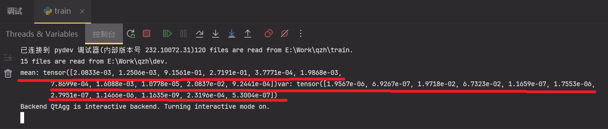

# Installation

> Here are the steps you can install it on your own computer.

> Skip if the preconditions have been met.

## 1. Install Anaconda

<https://www.anaconda.com/download>

[Here](https://zhuanlan.zhihu.com/p/459601766) is the installation tutorial.

## 2. Create virtual conda environment

Open Anaconda Prompt, type in the following codes.

In which the 'qzh' stands for the name of the environment, customize it if you like.

#### - Method 1: you can simply clone my environment like this:
```powershell
$powershell
cd your_download_path/qzh
conda env create -f requirements.yml
```

#### - Method 2: Or you can reshow the environment like this:

```powershell
$powershell
cd your_download_path/qzh
conda create  --name your_env_name --file spec-list.txt
```
# Usage

## 1. Prepare the nnmodel python file

Extract or Git Clone the qzh zip pack to your folders, make sure there is no Chinese character within path.

Modify the following codes to your own absolute path in nnmodel.py. There should be **4** different datasets:

- **train data** for training
- **dev data** for cross validation
- **test data** for testing, which might be not necessary
- **all data** for calculating the global mean and standard deviation

```python
# python, nnmodel.py
train_data = DataReader(r'D:\Work\qzh\train')
dev_data = DataReader(r'D:\Work\qzh\dev')
test_data = DataReader(r'D:\Work\qzh\test')
```

## 2. Prepare your dataset

These key word must be contained within the path or the name of the *.csv file:

- coated000 : f
- df00 : df
- 000fcom000 : re1, im1 | first complex numer
- 000scom000 : re2, im2 | second complex numer
- 000nm : lambda
- radius00 : R
- thinly / thickly : C | 1 / 0

Examples:

```plaintext
./train/thickly/195fcom079/155scom000/350nm/coated005.csv
or
./dev/thinly/404nm/coated020/155scom000/195fcom079/df18.csv
or
./test/thinly_coated60_df18_700nm_195fcom079_155scom000.csv
or
...
```

## 3. Train
### Before training: IF you are using a different dataset from defaults, RE-compute the mean and  standard deviation with the following steps.
#### step1： Copy all the data to the dir named "all". Change the following codes.
```python
train_data = DataReader(r'E:\Work\qzh\train') ->
train_data = DataReader(r'E:\Work\qzh\all')
```
#### step2: Then Uncomment the following codes. Break line of the code after 'print'
```python
# __Calculate the mean and standard deviation
 _mean = torch.mean(self.x, dim=0)
 _var = torch.var(self.x, dim=0)
 print(f"mean: {_mean}"
       f"var: {_var}")
# __=========================================
============MARK BREAK POINT HERE============
_mean = torch.tensor([2.0789e-03, 1.2479e-03, 9.1428e-01, 2.7399e-01, 3.7701e-04, 1.9827e-03,
                          7.8541e-04, 1.6054e-03, 1.0729e-05, 2.0793e-02, 9.2274e-04], dtype=torch.float32)
_var = torch.tensor([1.9525e-06, 6.9122e-07, 2.0225e-02, 6.8118e-02, 1.1622e-07, 1.7514e-06,
                         2.7886e-07, 1.1442e-06, 1.1588e-09, 2.3138e-04, 5.2836e-07], dtype=torch.float32)
```
#### step3: Then run the *train.py* with debug mode to get the *_mean* and *_var*.

#### step4: Comment the codes. Renew the *_mean* and *_var* with the printed values.
```python
# __Calculate the mean and standard deviation
#  _mean = torch.mean(self.x, dim=0)
#  _var = torch.var(self.x, dim=0)
#  print(f"mean: {_mean}"
#        f"var: {_var}")
# __=========================================
=========YOUR NEW MEAN AND VAR HERE==========
_mean = torch.tensor([2.0789e-03, 1.2479e-03, 9.1428e-01, 2.7399e-01, 3.7701e-04, 1.9827e-03,
                          7.8541e-04, 1.6054e-03, 1.0729e-05, 2.0793e-02, 9.2274e-04], dtype=torch.float32)
_var = torch.tensor([1.9525e-06, 6.9122e-07, 2.0225e-02, 6.8118e-02, 1.1622e-07, 1.7514e-06,
                         2.7886e-07, 1.1442e-06, 1.1588e-09, 2.3138e-04, 5.2836e-07], dtype=torch.float32)
```
#### step5: Change back to the original path and Train.
```python
train_data = DataReader(r'E:\Work\qzh\all') ->
train_data = DataReader(r'E:\Work\qzh\train')

$powershell
conda activate qzh
cd ./qzh
python train.py
```
#### step6: Visualize the training process
Open your cmd or terminal, input the following command to get into tensorboard. Modify if you are using a different path.
```bash
$ powershell
tensorboard --logdir="qzh/tensorboard" --port=6007
```
## 4. Reasoning

*Still writing...*